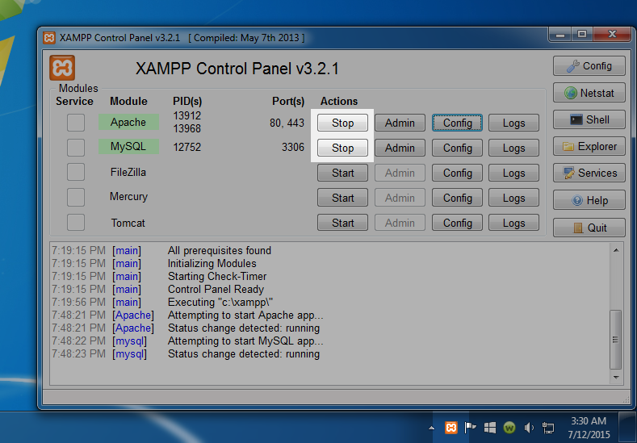
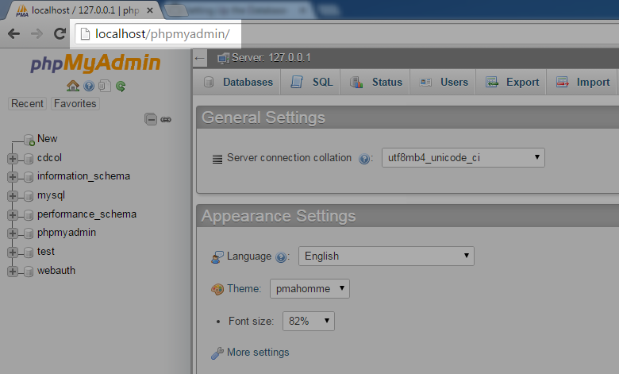

# Wedding Organizer

1. Télécharger & installer [GitHub Desktop](https://desktop.github.com/).

2. Démarrez GitHub Desktop pour vous connectez à votre compte GitHub.

3. Sur GitHub Desktop, sélectionnez `boulaffasae/weddingorganizer` pour clonez une copie sur votre dossier htdocs `C:\xampp\htdocs\`.

4. Sur XAMPP panel de contrôle lancez `Apache, MySQL`.

5. Naviguez vers (http://localhost/phpmyadmin/)[http://localhost/phpmyadmin/].

6. Importez la base de données `C:\xampp\htdocs\weddingorganizer\weddingorganizer.sql`.

7. Connectez-vous au (http://localhost/weddingorganizer)[http://localhost/weddingorganizer/admin/login.php].

Nom d'utilisateur: `admin`
Mot de passe: `admin`

**Todo list**

- [ ] Traduire l'interface en français.
